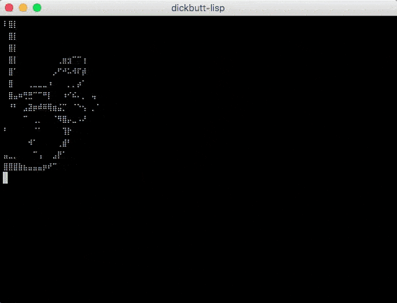

# dickbutt-lisp

Common Lisp dickbutt FFI example

## Requirements

Works best on Linux:

```text
sudo apt-get install clisp
```

Or use [Vagrant](https://www.vagrantup.com/):

```text
vagrant up && vagrant ssh
```

## Usage

```text
make test
```

## Output


